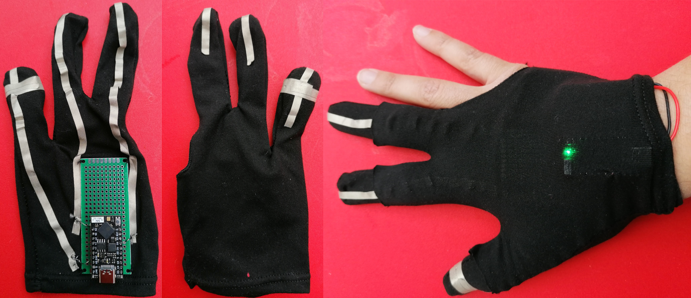
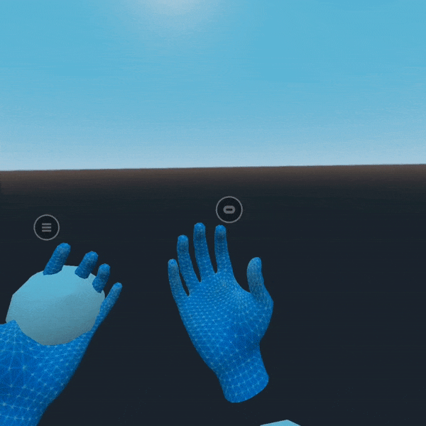

PinchGlove—Physically detect pinch on the Oculus Quest
======================================================

The PinchGlove is an input device for the Oculus Quest 2. When used alongside the hand tracking of the headset, the glove detects a pinch of the index or the middle finger based on an unambiguous electric contact rather than image detection.

It is mostly useless, but I was wondering if it was possible.

## Motivation

This glove is inspired by the [OMG-VR gloves](https://arxiv.org/abs/1901.03532) (also on [instructable](https://www.instructables.com/Etextile-VR-Gloves-for-Vive-Tracker/)). The OMG-VR gloves were developed for Vive trackers and allow to track the hand's position and to detect pinches ("mudra" poses); all in the lightest package possible. They depend on the SteamVR lighthouses and are not compatible with the increasingly popular Oculus Quest 2 headset.

The PinchGlove attempts to achieve the same thing for the Quest. Except that the Quest has a hand tracking feature and can detect pinches using computer vision. This detection, however, can be confused with "near-contacts", occlusion, or when the hand is out of view. The glove is tracked using the headset's hand-tracking feature but detects the pinches using an electrical contact that is unambiguous.

To interface with the VR headset, the glove presents itself as a Bluetooth gamepad. Making a pinch emulates a button press.

## In this repository

This repository contains a description of the glove and instructions to build it, the code for the firmware, and a minimal "game" to demonstrate the functionality of the glove.

## Building the glove

The "brain" of the glove is an ESP32 microcontroller with Bluetooth functionality. For this specific build, I used a [TinyPICO](https://www.tinypico.com/) development board that exposes all the microcontroller's pins, allows to program the chip and communicate with UART via USB, and has the circuitry to charge a LiPo battery. Because I wanted to use the board for other applications, I soldered female header pins to a protoboard that was sawed to the glove using regular thread; the board could be sawed to the glove directly, which would remove most of the bulkiness.

I used a pool glove with 3 fingers to match the aesthetics of the OMG-VR glove. Any glove would work.

The fingers are connected to the board using conductive fabric and conductive thread. A strip of adhesive conductive fabric goes from the tip of each finger to the back of the hand, next to the board. The conductive thread then goes through the conductive fabric and in holes of the board. The thumb is connected to ground, the index is connected to pin 25, and the middle finger is connected to pin 21.

I wear a second glove on top of the first one. That second glove covers the electronics that would otherwise have an adverse effect on hand tracking. It also maintains the battery in place. The tips of the second glove's fingers are cut so that the conductive fabric is exposed.

I used the following parts to build the glove:

* pool gloves <https://www.amazon.co.uk/gp/product/B08K8ZV7XB/>
* TinyPICO <https://shop.pimoroni.com/products/tinypico-v2?variant=39285089534035>
* conductive fabric <https://shop.pimoroni.com/products/woven-conductive-tape>
* conductive thread <https://shop.pimoroni.com/products/adafruit-stainless-medium-conductive-thread-3-ply-18-meter-60-ft>
* prototype board <https://www.amazon.co.uk/gp/product/B0775BRB6B/>

## Building the firmware

The firmware for the glove is written in C++ using the Arduino API. The sketch is available in the `Firmware` directory. It relies on the [ESP32-BLE-Gamepad](https://github.com/lemmingDev/ESP32-BLE-Gamepad) library to expose the glove as a Bluetooth gamepad, and the [TinyPICO Arduino helper library](https://www.tinypico.com/code-examples) to manage the RGB LED.

To install the firmware on the glove:

* open it with the [Arduino IDE](https://www.arduino.cc/en/software)
* install the ESP32-BLE-Gamepad and the TinyPICO libraries using the library manager
* install the specification for the TinyPICO board by following [the instructions on the TinyPICO website](https://www.tinypico.com/gettingstarted)
* choose the right board and port in the IDE
* plug the TinyPICO board into the computer
* upload the sketch.

## Running the demo

The demonstration "game" shows the users hand and two spheres attached to the hands. The sphere becomes green when the glove detects a pinch between the thumb and the index, and red when it detects a pinch between the thumb and the middle finger.

The demo is written with the [Godot engine](https://godotengine.org/) and use the [godot oculus quest toolkit](https://github.com/NeoSpark314/godot_oculus_quest_toolkit) to run on the Oculus Quest 2. Follow the [setup instructions](https://github.com/NeoSpark314/godot_oculus_quest_toolkit/wiki/Tutorial-01-Setup) to configure both the Godot editor and your Oculus Quest to run the demo.
